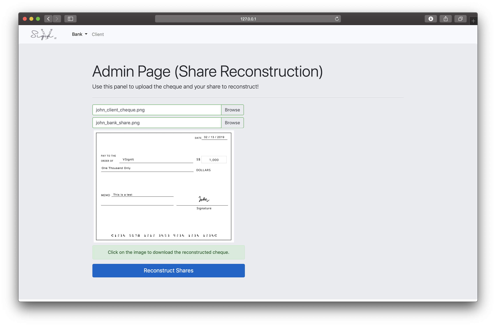

# Visual-Cryptography (Group SS19/1C)
Secure Remote Authentication using Visual Cryptography

<b>PLEASE EXPLAIN WHAT YOU HAVE EDITED IN THE COMMIT STATEMENT WHEN YOU ARE ADDING OR EDITING A FILE.</b>

The aim of this project is to develop a secure user authentication system based on
visual cryptography. 

Visual cryptography is a special cryptographic technique for
hiding visual information in images. The information can be decrypted only when
the correct key image is used. 

In this project, we will apply the visual
cryptographic technique to build a secure remote user authentication system. A
web-based prototype will be built to validate the feasibility of the system.
Basic knowledge on cryptographic algorithms and protocols such as encryption,
cryptographic hash function, and TLS/SSL.

<b>To run the program:</b>
1. Download Pillow: 
```shell
pip install Pillow
```
2. Download Flask
```shell
pip install Flask
```
3. To run, type this on your terminal
```shell
FLASK_APP=VSignIt.py FLASK_DEBUG=1 python -m flask run
```

<b>Here are the sample screenshots of our current program:</b>


