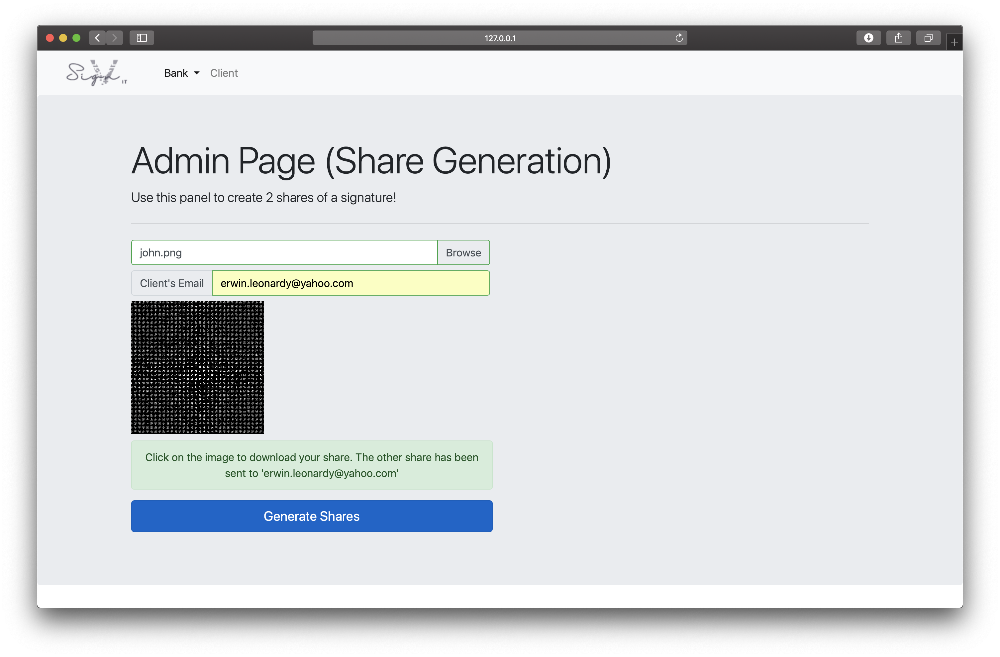

vSignIt 
======
Visual-Cryptography (Group SS19/1C)
Secure Remote Authentication using Visual Cryptography


<b>PLEASE EXPLAIN WHAT YOU HAVE EDITED IN THE COMMIT STATEMENT WHEN YOU ARE ADDING OR EDITING A FILE.</b>

The basis of our project is to define a secure authentication mechanisms for users to access remotely, through the use of visual cryptography. To achieve this, we have devised a system that operates on the basis of user signatures, where the signatures will be used to authenticate a legal document. Through an online platform, we allow users to provide an image of a signature, from which two shares that appear as random noise emerge. One of the shares is to be kept by the user, while the other is sent to a party that requires authentication. In order to provide the authentication, the party requiring authentication on the legal document sends in their complete document, inclusive of the share, while the recipient will in turn provide their share to complete the authentication.

For our final product, VSignIT, our primary focus will be electronically authenticating signatures on cheques. However, while the focus of the project is in the banking domain, the usage of the application can be generalized to serve as an authentication for any legal document requiring signatures within an organisation.

Pre-Installation 
------
1. You would have to install Apache, phpMyAdmin, and MySQL to get the database running.
* For Windows user:

Please [click here to install WAMP Server](https://www.google.com) that would handle everything for you. There is a [detailed instruction here](https://www.wikihow.com/Install-phpMyAdmin-on-Your-Windows-PC) regarding the installation.

* For MAC user:

Apache came pre-installed. Do follow the instuctions [here](https://medium.com/@jangid.hitesh2112/install-apache-mysql-php-macos-mojave-10-14-b6b5c00b7de) to get things up and running.

2. When you managed to get phpMyAdmin running, run the sql script that can be found in the <b>./helper</b> folder.
Click [here](https://github.com/erwinleonardy/Visual-Cryptography/blob/master/helper/vsignit.sql) to view the file.

Installation 
------
1. Download Pillow
```shell
pip install Pillow
```
2. Download Flask
```shell
pip install Flask
```

Execution
------
1. To run, type this on your terminal.
note: FLASK_ENV would allow you to refresh the website without having to quit (ctrl+c) the application that you are currently running.
* MAC:
```shell
FLASK_APP=VSignIt.py FLASK_DEBUG=1 python -m flask run
```
* Windows (Doesn't work with PowerShell, you have to use cmd):
```shell
set FLASK_APP=VSignIT.py
set FLASK_ENV=development
flask run
```
2. Open up your browser and type in the localhost address and the port number. The home page has been set to the share generation page. 
```shell
http://127.0.0.1:5000
```

Here are the sample screenshots of our current program
------



